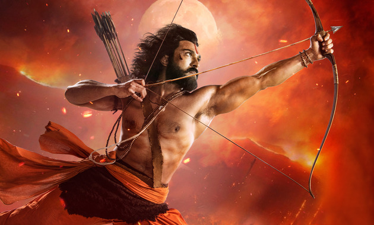
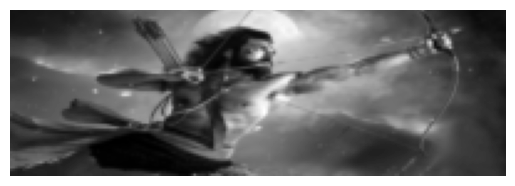
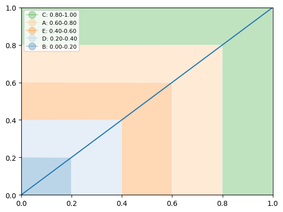
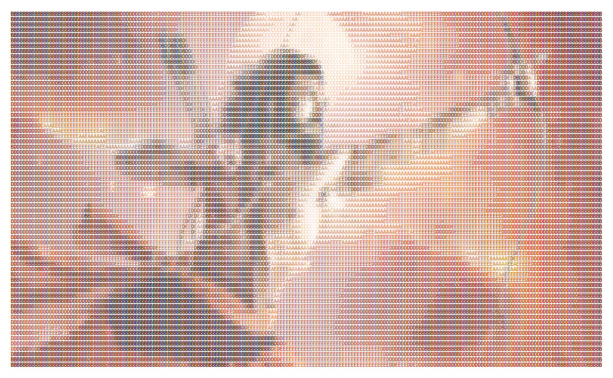
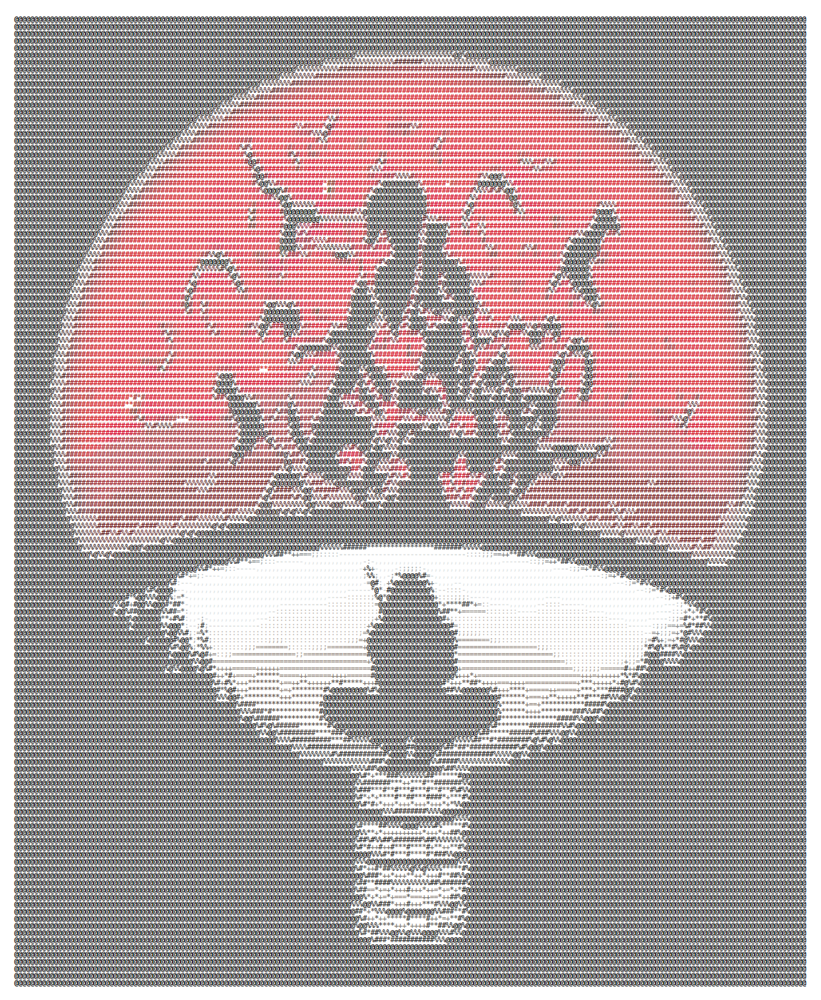
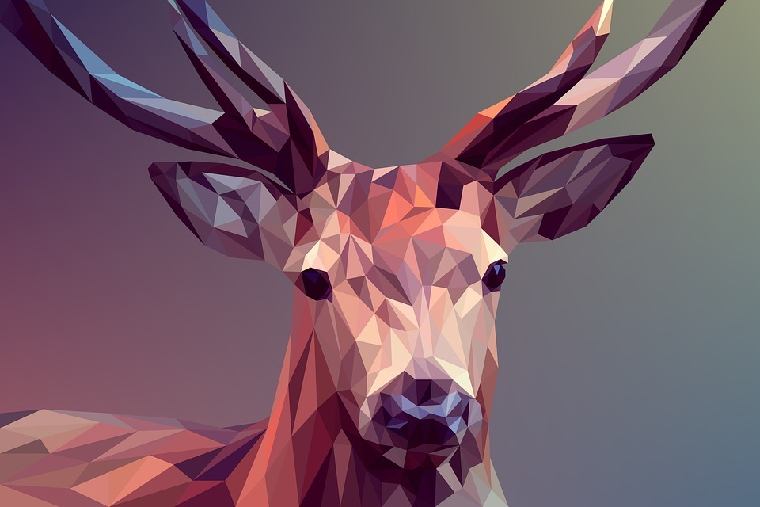
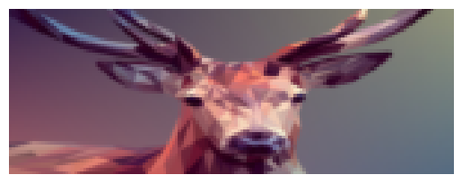
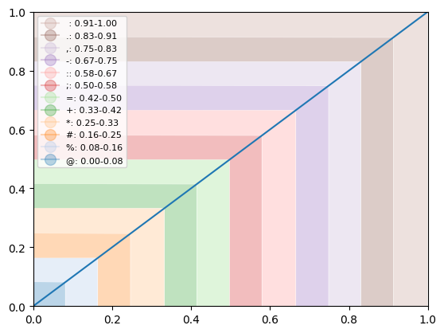
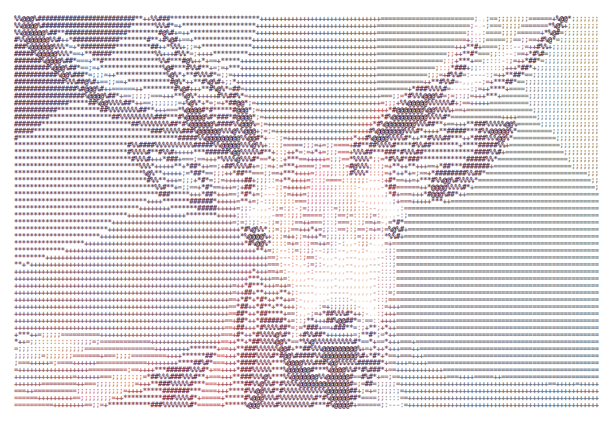

# Gallery

## Example 1

<!-- {width="400", loading=lazy, align=left} -->

<figure markdown>
  {width="500", loading=lazy}
  <figcaption>RRR-Ram Charan</figcaption>
</figure>

```python
from aksharify import AksharArt
from aksharify.image import Image
from aksharify.distributions import *
from aksharify.outputs import *
```

```python
image = Image(url = "https://sm.mashable.com/mashable_in/seo/2/25689/25689_nevk.jpg")
image.resize(200)
image.normalize()
image.show(grayscale=True)
```
    


```python
lin = Linear("ABCDE", order=True)
lin.show()
```
    

    

```python
art = AksharArt(image, lin)
art.aksharify(show=True)
```




```python
config = SVG()
config.file_name = "rrr"
config.bold = True
```

```python
art.export(config)
```

## Example 2

<figure markdown>
  {width="500", loading=lazy}
  <figcaption>Naruto-Itachi Uchiha</figcaption>
</figure>

```python
from aksharify import AksharArt
from aksharify.image import Image
from aksharify.distributions import *
from aksharify.outputs import *
```

```python
image = Image(path = "images/itachi.jpg")
image.resize(200)
```

```python
# with default chars
normal = Normal(mean=0.38, var=1.3)
art = AksharArt(image, normal)
```

```python
art.aksharify()
art.show()
```
    



```python
config = PNG()
config.file_name = "itachi"
config.fill_color = "#000000"
```


```python
art.export(config)
```

## Example 3

<figure markdown>
  { width="500", loading=lazy}
  <figcaption>Graphical Image</figcaption>
</figure>


```python
image = Image(url="https://www.codespaces.com/wp-content/uploads/2019/12/GraphicDesign.jpg")
image.resize(150)
image.show()
```
    



```python
linear = Linear()
linear.show()
```
    



```python
art = AksharArt(image, linear)
art.aksharify(show=True)
```
    



```python
config1 = TXT()
config1.file_name = "graphics"
```

```python
config2 = SVG()
config2.file_name = "graphics"
config2.fill_color = "#00ff00"
```

```python
art.export(config1, config2)
```

## Example 4

```python
from aksharify import EdgeArt, hexify
from aksharify.image import Image
from aksharify.distributions import Linear
from aksharify.outputs import SVG

# Step 1: Load the image from the given URL
image = Image(url="https://th.bing.com/th/id/OIP.a7I8ZIepC_tU2aEUdyknawHaEP?pid=ImgDet&rs=1")
image.resize(200)
image.edgefy(show=True)

# Step 2: Create an "EdgeArt" object with the image and a linear distribution
lin = Linear()
art = EdgeArt(image, lin)

# Step 3: Generate ASCII art with a custom background character " " (i.e. non-edge pixel)
art.aksharify(bg_char=" ", show=True)

# Step 4: Configure the output format as SVG with a white background color using the "hexify" function to convert the color name to a hex code
config = SVG()
config.file_name = "art"
config.background_color = hexify("white")
# Export the ASCII art to an SVG file
art.export(config)
```